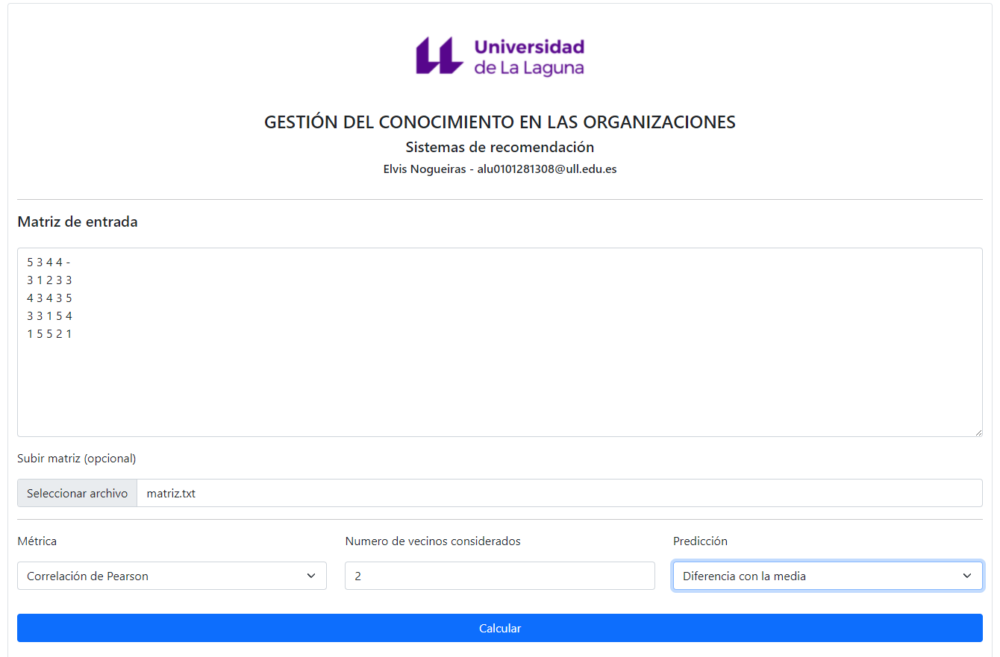
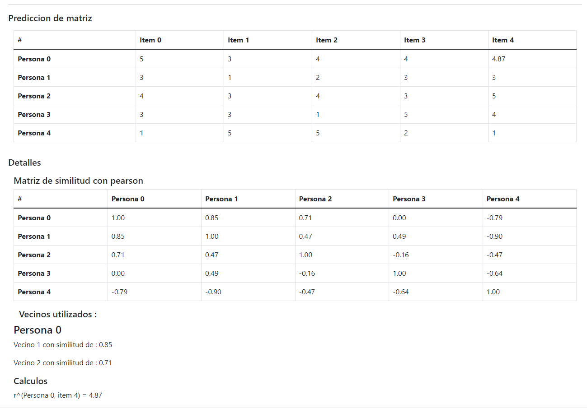

# Sistema de recomendación

Para usar la aplicación unicamente debe rellenar los campos que se piden :

1) Subir o cargar una matriz.
2) Seleccionar una metrica.
    - Correlación de Pearson. 
    - Distancia Coseno.
    - Distancia Euclidiana.
3) Establecer el numero de vecinos que se va a considerar. (No introducir mas vecinos que las personas registradas en la matriz).
4) Que formula de prediccion se usará
    - Predicción Simple.    
    - Diferencia con la media. 

 ## Ejemplo de uso

 Se rellenan los campos como se aprecia en la siguiente imagen :

    

 Una vez rellenados todos los campos, damos click en calcular y nos aparecerá la siguiente información :
 
  

 ## Pagina de la app

 [Sistemas de recomendación](https://alu0101281308.github.io/GCO-sistemas-de-recomendacion/)